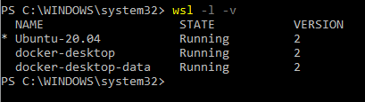
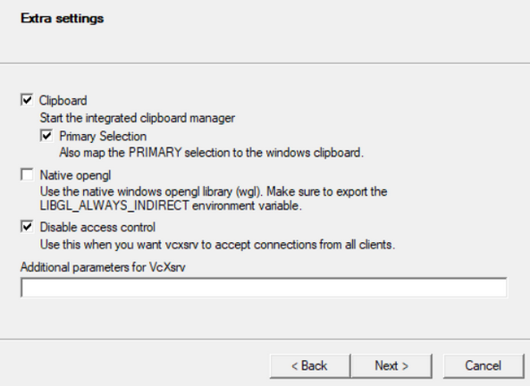
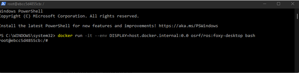
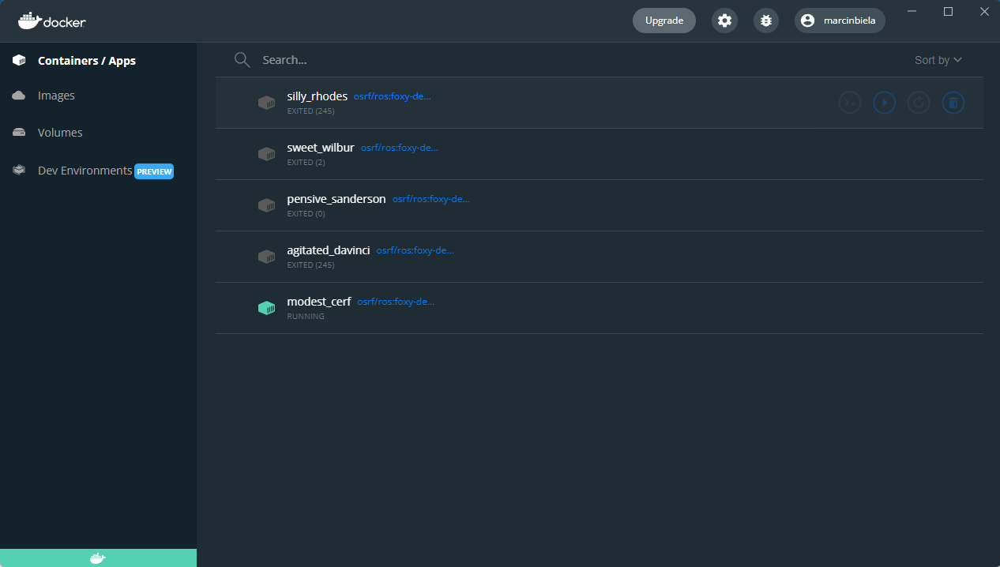
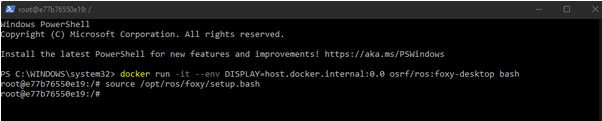
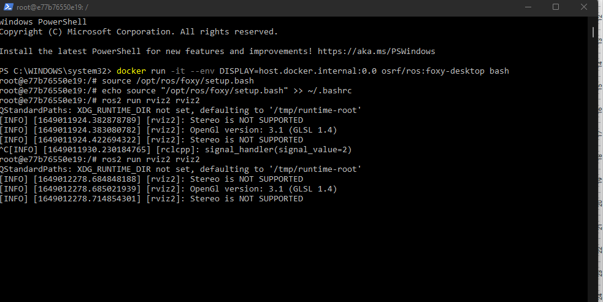
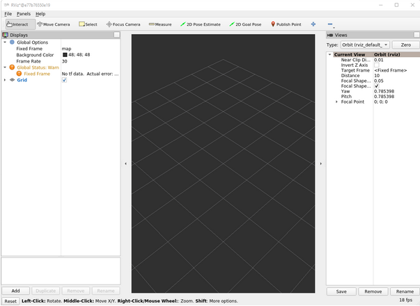

# Konfiguracja dockera na systemie windows 10//11 wraz z obrazem ROS’a

1. Aby poprawnie zbudować obraz na dockerze potrzebne będzie zainstalowanie WSL-Windows Subsystem for Linux w wersji drugiej.
- Instalacja wsl - Otwórz PowerShell lub Command Prompt (cmd) jako administrator i wprowadź następującą komendę

`wsl  --install`

Następnie restartujemy komputer

Powyższa komenda powinna zainstalować Ubuntu w wersji 20.04, możemy to sprawdzić wpsiując w terminal następującą komendę

`wsl -l -v`

Jeżeli posiadamy już WSL w wersji 1 należy go zaktualizować do wersji drugiej:

`wsl --set-version Ubuntu-20.04 2`

2. Instalacja Docker Desktop na windows 10/11 

Aby móc wirtualizować obrazy na dockerze należy włączyć taką możliwość ustawieniach BIOS’u.

Dockera pobieramy z pod tego linku https://docs.docker.com/desktop/windows/install/
i instalujemy.

3. Pobieranie obrazu Ubuntu z ROS’em.
Otwieramy **Docker Desktop**.

W PowerShellu wpisujemy: 

`docker pull osrf/ros:foxy-desktop`

Powyższa komenda pobiera obraz ROS’a w wersji Foxy

4. Instalacja narzędzia VcXsrv Windows X Server

https://sourceforge.net/projects/vcxsrv/

Narzędzie to pozwala wyświetlać na komputerze z Windows okna programów zainstalowanych na wirtualnych maszynach uniksowych.

Po zainstalowaniu uruchamiamy program XLaunch i dokonujemy konfiguracji, wszystkie okna pozostawiamy z ustawieniami domyślnymi poza “Extra Settings” tutaj ustawiamy następujące parametry:

## Uruchamianie Obrazu

5. Po zainstalowaniu narzędzia możemy przejść do uruchamiania obrazu ROS’a.

`docker run -it --env DISPLAY=host.docker.internal:0.0 osrf/ros:foxy-desktop bash`

Za każdym uruchomieniem tej komendy będzie tworzona nowa aplikacja/kontener

6. Ładowanie setupu ROS’a

`echo source "/opt/ros/foxy/setup.bash" >> ~/.bashrc`

wczytując taki setup do bashrc sprawiamy, że za każdym razem gdy będziemy otwierać nowy terminal te ustawienia zostaną wczytane automatycznie.

7. Testowanie utworzonego obrazu

Aby przetestować czy wszystko działa poprawnie należy wpisać następującą komendę:

`ros2 run rviz2 rviz2`

Jeżeli wszystko poszło pomyślnie to powinno pojawić się następujące okno.

Linki: 

- https://jack-kawell.com/2019/09/11/setting-up-ros-in-windows-through-docker/
- https://docs.microsoft.com/en-us/windows/wsl/install
- http://docs.ros.org/en/ros2_documentation/foxy/How-To-Guides/Run-2-nodes-in-single-or-separate-docker-containers.html

